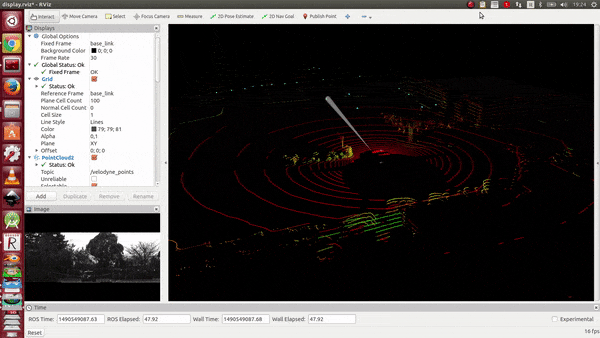

#  DiDi Challenge 

[Here](https://www.udacity.com/didi-challenge) you can find more info about the challenge. In this repository you will find a simple launch file to play a rosbag file and visualize the result in RViz.

[](https://www.youtube.com/watch?v=8ajTBb6EDWE)

## Instructions:

### Install ROS:

Follow instructions you find in this <a href="http://wiki.ros.org/ROS/Installation" target="_parent">page</a>.

* Point 1.2 : choose instructions for your version of Ubuntu.

* Point 1.4 : Desktop-Full Install: (Recommended).

* When you configure the ROS Environment, choose catkin.

* Complete the tutorial <a href="http://wiki.ros.org/ROS/Tutorials" target="_parent">page</a>. It is mandatory to follow the tutorial number 1 "Installing and Configuring Your ROS Environment".

Now we have installed ROS and we have created our workspace.

* Open the file bashrc:
	` gedit ~/.bashrc`
if you want to avoid to type the following command every time, add in the end of the file :	
	
  ``` 
  export ROS_PACKAGE_PATH=${ROS_PACKAGE_PATH}:/path_to_catkin_ws/catkin_ws/src
  source /opt/ros/indigo/setup.bash
  source /path_to_catkin_ws/catkin_ws/devel/setup.bash
  ```
Remember to change `/path_to_catkin_ws` with your path and change `indigo` if you are using another version of ROS.

Close the terminal an open a new one.

I used Ubuntu 14.04 and ROS Indigo.

### Download dataset:
* Download the 32GB dataset from [here](http://academictorrents.com/details/76352487923a31d47a6029ddebf40d9265e770b5).

### Clone the repo:
* Go in the src folder of your catkin workspace in catkin_ws/src via terminal   
* Clone the repository typing:   
  `$ git clone https://github.com/jokla/didi_challenge_ros.git`   
* Go in your `catkin_ws` and do `catkin_make`:   
  `$ cd ~/catkin_ws`   
  `$ catkin_make`   
* Now source the setup.bash;   
  `$ source ~/catkin_ws/devel/setup.bash`   
* Check if ROS is able to find the package:  
  `$ roscd didi_challenge_ros`  


### Visualize Lidar, camera and Laser using RViz:
Launch `display_rosbag_rviz.launch` setting the path to the rosbag file you want to use:   
 ```
 $ roslaunch didi_challenge_ros display_rosbag_rviz.launch rosbag_file:=CHANGE_WITH_PATH/approach_1.bag
 ```
 
#### Explanation launch file
The launch file `display_rosbag_rviz.launch` is doing the following:
* Playing in loop the rosbag file   
```
<arg name="rosbag_file" default="my_file_1" />
<node pkg="rosbag" type="play" name="player" output="screen" args="-l $(arg rosbag_file) "/>
```
* Publishing the transformation between the link 'base_link' and 'velodyne'    
```
<node pkg="tf2_ros" type="static_transform_publisher" name="link1_broadcaster" args="1.9 0 1.6 0 0 0 1 base_link velodyne" />
```

 * Opening RViz with the setting file 'display.rviz'   
```
<node name="rviz" pkg="rviz" type="rviz" args="-d $(find didi_challenge_ros)/launch/display.rviz" />
```
